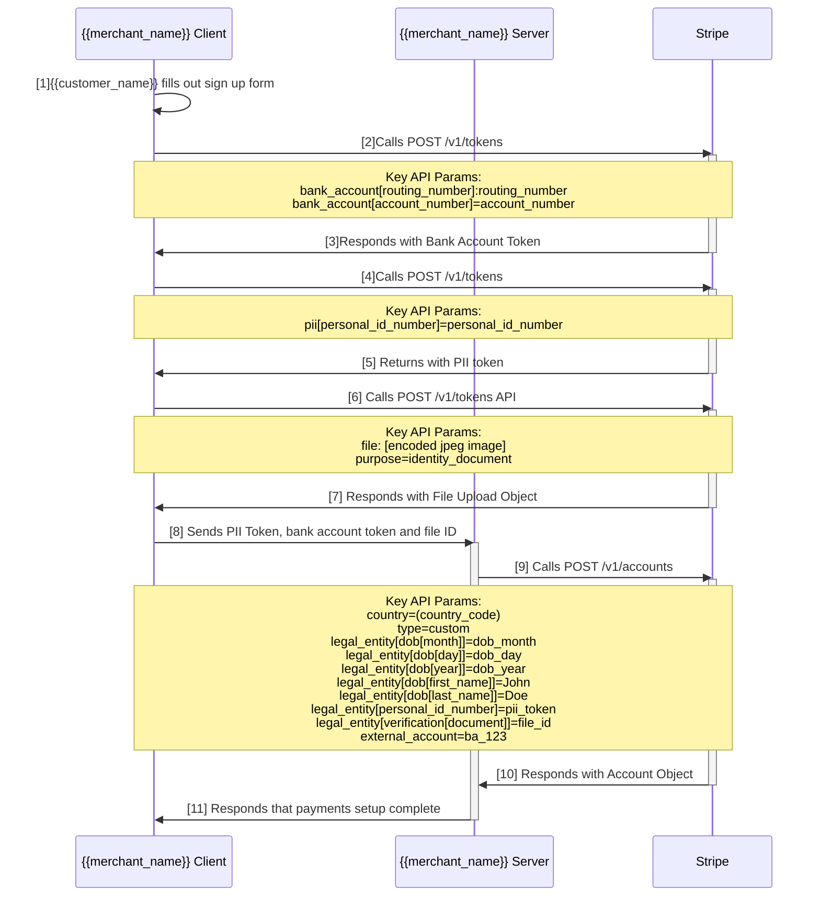
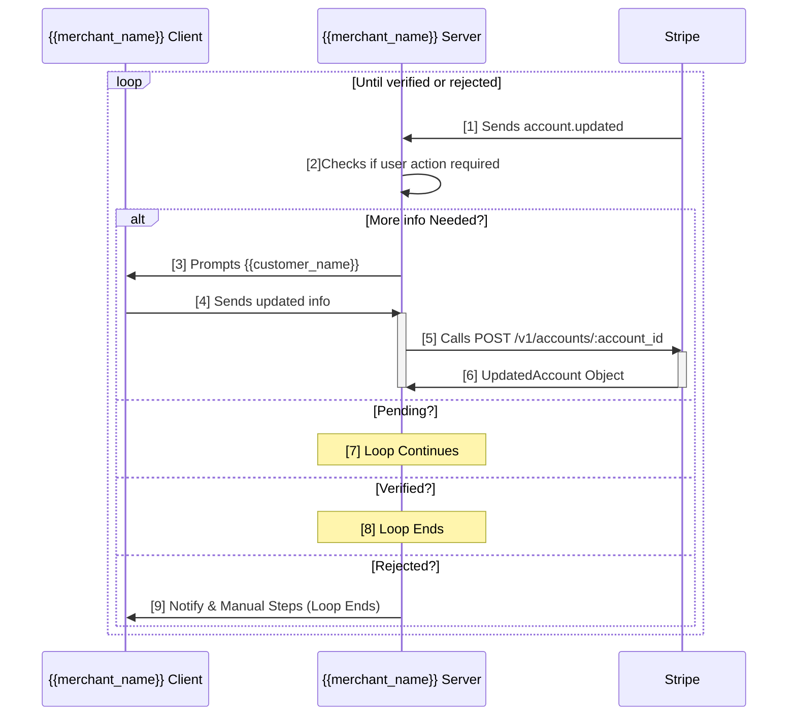

## Required Information

Connect onboarding can be all 'up-front' in which the {{merchant_name}} can collect all of their {{connect_account_name}} information at user registration. Alternatively, {{merchant_name}} can use tiered onboarding to gradually collect less information at sign up and more information as the {{connect_account_name}} earns more revenue.

Gradual onboarding may be more useful where the {{connect_account_name}} has a higher risk of abandoning the onboarding process. However, gradual onboarding requires that the {{connect_account_name}} return to the {{merchant_name}} onboarding forms in the future for more information. You can read more about fulfilling multiple verification stages [here](https://stripe.com/docs/connect/testing-verification#fulfilling-multiple-stages).

Required information for a connect account in a given country can be found in the [Stripe Documentation](https://stripe.com/docs/connect/required-verification-information) and is programmatically accessible via the [Country Specs API](https://stripe.com/docs/api#country_specs).

## Custom Connect Up-front Onboarding Sequence Diagram



_Sequence Diagram of the merchant onboarding flow via Custom Connect. The steps below correspond to the numbers in the diagram_

1. The merchant visits the {{merchant_name}} merchant onboarding website and fills out a sign up form containing bank account and social security number information.
1. The {{merchant_name}} frontend calls POST /v1/tokens to create bank account token from the data entered on the form. This is used to securely collect bank account information by sending the information directly to Stripe. For European IBANs, `routing_number` is not required.

   ```bash
   curl -X POST https://api.stripe.com/v1/tokens \
     -u {{test_public_key}}: \
     -d bank_account[account_number]=000123456789 \
     -d bank_account[country]=US \
     -d bank_account[currency]=USD \
     -d bank_account[routing_number]=110000000 \
     -d bank_account[account_holder_name]="John Doe" \
     -d bank_account[account_holder_type]="individual"
   ```

   _An example call to the tokens API for creating a bank account token_

1. Stripe responds with a bank account token
1. {{merchant_name}} frontend calls the POST /v1/tokens API to create a PII token. This is used to securely collect social security numbers sending the information directly to Stripe.

   ```bash
   curl -X POST https://api.stripe.com/v1/tokens \
     -u {{test_public_key}}: \
     -d pii[personal_id_number]=123456789
   ```

   _An example call to the tokens API for creating a PII token_

1. Stripe responds with a pii token
1. Using the Stripe Platform account’s publishable key, the {{merchant_name}} frontend should upload images of the ID directly to Stripe by calling the POST /v1/files API with a Content-Type header of multi-part/form-data. This avoids ID images from passing through {{merchant_name}}’s infrastructure.

   ```bash
   curl https://files.stripe.com/v1/files \
   -u {{test_public_key}}: \
   -F purpose=identity_document \
   -F file="@/path/to/license_front.jpg"
   ```

   _An example call to the /v1/files API. You will likely use the client-side available file interface on iOS, Android or Web_

1. Stripe responds with a [File Upload Object](https://stripe.com/docs/api#file_uploads).

1. The {{merchant_name}} frontend calls the {{merchant_name}} back end server with the pii token, bank account token and file upload ID. This interface is defined by {{merchant_name}}.
1. The {{merchant_name}} server should then call the POST /v1/accounts API to create a new Stripe Connected Account on behalf of the merchant. Note all information does not need to be provided upfront. Tiered onboarding can allow the merchant to enter information only as needed as they get paid more and more. See the Custom Account Updates section for details.

   ```bash
   curl -X POST -u {{test_api_key}}: https://api.stripe.com/v1/accounts \
   -d country=US \
   -d email=johndoe@{{merchant_name}}.com \
   -d type=custom \
   -d external_account=btok_1BZ4I4Cz5V6sF6ISELtWbEua \
   -d legal_entity[address[city]]="San Francisco" \
   -d legal_entity[address[line1]]="185 Berry St"
   -d legal_entity[address[state]]="California"
   -d legal_entity[address[postal_code]]="94129"
   -d legal_entity[dob[day]]=15
   -d legal_entity[dob[month]]=5
   -d legal_entity[dob[year]]=1992
   -d legal_entity[type]=individual
   -d legal_entity[first_name]=John
   -d legal_entity[last_name]=Doe
   -d tos_acceptance[date]=1511730506
   -d tos_acceptance[ip]="127.0.0.1"
   -d legal_entity[verification[document]]=file_1BZ4e3Cz5V6sF6ISHYZTO18p
   -d legal_entity[personal_id_number]=pii_1BZ4XxCz5V6sF6IShTj0pKHv
   ```

   _An example API call to create a Stripe Custom Connected Account_

1. Stripe responds with an Account object.
1. {{merchant_name}}’s server responds to {{merchant_name}} front-end that payments setup is complete.

### Collecting PII

When collecting PII like government ID numbers (eg: Social Security Number in the US) Stripe recommends collecting this information by tokenizing this client-side using Stripe.js. Here is how to create a bank account token with Stripe.js

```js
stripe
  .createToken("bank_account", {
    country: "US",
    currency: "usd",
    routing_number: "110000000",
    account_number: "000123456789",
    account_holder_name: "Jenny Rosen",
    account_holder_type: "individual"
  })
  .then(function(result) {
    // Handle result.error or result.token
  });
```

_An example creation of a bank account token using Stripe.js_

### Collecting Photo ID Images

When collecting [images of documentation such as drivers licenses](https://stripe.com/docs/connect/identity-verification-api#acceptable-id-types) Stripe recommends using the File Upload API from the client-side to upload the images directly Stripe.

### Using Account Tokens

If you don't want to touch the connected account's information you can submit it client side using [account token](https://stripe.com/docs/connect/account-tokens).

# Verification

Custom connected accounts go through three distinct verification states which can be found in the Account Object's [`legal_entity.verification.status`](https://stripe.com/docs/api#account_object-legal_entity-verification-status) parameter. When a {{connect_account_name}} onboards to {{merchant_name}}, the {{connect_account_name}} will transition between these states through the lifetime of the account. Changes in account state can be tracked by listening to the [`account.updated`](https://stripe.com/docs/api#event_types-account.updated) webhook event.

## Connect Account Verification States

A custom connect account goes through several distinct states and can be described as a state machine in the diagram below.

{{./custom/automated/verification-state-diagram.svg}}

_{{connect_account_name}} Connected Account Verification States_

1. {{merchant_name}} submits {{connect_account_name}}'s verification information (either the minimum required info or all up-front).
1. The account is now in the `pending` state.
1. Stripe runs an automated validation of the account details. Its possible, depending on the account that Stripe will manually review the account. Either way, this does not change the workflow here.
1. Verification passed and the merchant now has (at least) all minimum required information and can continue receiving Payouts to their bank account.
1. If the merchant triggered the next verification stage, the account goes into the UNVERIFIED state, otherwise the account remains in the VERIFIED state. If the merchant has already submitted all applicable verification information, the account will not go back to the UNVERIFIED state.
1. {{merchant_name}} notifies {{connect_account_name}} that they will need to provide the next stage's verification information (defined in the [`verification.fields_needed`](https://stripe.com/docs/api#account_object-verification-fields_needed) array)
1. There was a verification error. {{merchant_name}} should inspect the [`legal_entity.verification`](https://stripe.com/docs/api#account_object-legal_entity-verification-status) field of the [Account Object](https://stripe.com/docs/api#account) to understand more details on why the verification failed.
1. The keyed information does not match the uploaded Photo ID
1. There was something wrong with the upload
1. {{merchant_name}} should prompt {{connect_account_name}} to check keyed information.
1. {{merchant_name}} should prompt {{connect_account_name}} to re-upload their Photo ID.
1. The {{connect_account_name}} is now in the `unverified` state. {{merchant_name}} should re-submit the required information.

## Verification Loop Step-by-Step

The actual implementation of verifying a {{connect_account_name}}'s connected account is an asynchronous loop with {{merchant_name}}'s server responding to [`account.updated`](https://stripe.com/docs/api#event_types-account.updated) events by calling the `Account Update` API with additional and updated information as specified in the [`account.updated`](https://stripe.com/docs/api#event_types-account.updated) events.



1. Stripe later sends the [`account.updated`](https://stripe.com/docs/api#event_types-account.updated) webhook with the new verification state of the account.
1. The {{merchant_name}} server should inspect the Account object's [`verification.fields_needed`](https://stripe.com/docs/api#account_object-verification-fields_needed)to check if any new information is required, [`verification.due_by`](https://stripe.com/docs/api#account_object-verification-due_by) to notify the {{connect_account_name}} when the information is due and the [`legal_entity.verification.status`](https://stripe.com/docs/api#account_object-legal_entity-verification-status) to get the current verification state of the {{connect_account_name}}.
1. If more information is needed {{merchant_name}} should reach out to the {{connect_account_name}} to get the required information specified by `fields_needed`.
1. The {{merchant_name}} client sends the updated account information to the {{merchant_name}} server. This interface is defined by {{merchant_name}}'
1. The {{merchant_name}} server calls the [Account Update API]() with the updated information.

   ```bash
   curl -X POST -u {{test_api_key}}: https://api.stripe.com/v1/accounts/acct_123 \
   -d legal_entity[dob[day]]=15 \
   -d legal_entity[dob[month]]=5 \
   -d legal_entity[dob[year]]=1992
   ```

   _An example API call to update a Stripe Custom Connected Account (id: act_123) with additional information_

1) Stripe responds with the updated Account Object.
1) If no new information is required and the `legal_entity.verification.status` is `pending` then no further action is required and {{merchant_name}} server will receive and other `account.updated` event in the future.
1) If the account is verified then no further action is required and the verification process is complete.
1) In exceptional cases, if the account is rejected then {{merchant_name}} should communicate that to the {{connect_account_name}} and optionally work with Stripe support on getting the user verified.

## Verification Stages Example

Verification has multiple stages which varies by market. To better understand what concretely happens during verification consider what might happen when {{merchant_name}} creates a Stripe custom connect account in the API calls below.

```bash
# Request to create a new {{connect_account_name}}'s connected account
curl https://api.stripe.com/v1/accounts -u {{test_api_key}}:
-d type=custom
-d country=US
```

_Stripe custom Connect account creation for a new {{connect_account_name}}_

Here is the starting state of the account:

```json
{
  "id": "acct_1CPbwUA8VkBpD0Vy",
  "object": "account",
  "business_name": null,
  "business_url": null,
  "charges_enabled": true,
  "country": "US",
  "created": 1525809466,
  "debit_negative_balances": false,
  "decline_charge_on": {
    "avs_failure": false,
    "cvc_failure": false
  },
  "default_currency": "usd",
  "details_submitted": false,
  "display_name": null,
  "email": null,
  "external_accounts": {
    "object": "list",
    "data": [],
    "has_more": false,
    "total_count": 0,
    "url": "/v1/accounts/acct_1CPbwUA8VkBpD0Vy/external_accounts"
  },
  "keys": {
    "secret": "sk_test_FWjrK0rdcWkFRaQLMaHzVH7V",
    "publishable": "pk_test_8jqlI1XkmCp8BaKz68Fmjtuy"
  },
  "legal_entity": {
    "additional_owners": [],
    "address": {
      "city": null,
      "country": "US",
      "line1": null,
      "line2": null,
      "postal_code": null,
      "state": null
    },
    "business_name": null,
    "business_tax_id_provided": false,
    "dob": {
      "day": null,
      "month": null,
      "year": null
    },
    "first_name": null,
    "last_name": null,
    "personal_address": {
      "city": null,
      "country": "US",
      "line1": null,
      "line2": null,
      "postal_code": null,
      "state": null
    },
    "personal_id_number_provided": false,
    "ssn_last_4_provided": false,
    "type": null,
    "verification": {
      "details": null,
      "details_code": null,
      "document": null,
      "status": "pending"
    }
  },
  "mcc": "5734",
  "metadata": {},
  "payout_schedule": {
    "delay_days": 2,
    "interval": "daily"
  },
  "payout_statement_descriptor": null,
  "payouts_enabled": false,
  "product_description": null,
  "statement_descriptor": "",
  "support_email": null,
  "support_phone": null,
  "timezone": "Etc/UTC",
  "tos_acceptance": {
    "date": null,
    "ip": null,
    "user_agent": null
  },
  "type": "custom",
  "verification": {
    "disabled_reason": "fields_needed",
    "due_by": null,
    "fields_needed": [
      "external_account",
      "legal_entity.dob.day",
      "legal_entity.dob.month",
      "legal_entity.dob.year",
      "legal_entity.first_name",
      "legal_entity.last_name",
      "legal_entity.type",
      "tos_acceptance.date",
      "tos_acceptance.ip"
    ]
  }
}
```

_State of a newly US connected account, before any verification information is applied._

Now consider the API request/response that happens when {{merchant_name}} enters [all minumim required information for the US](https://stripe.com/docs/connect/required-verification-information#minimum-verification-requirements-for-united-states).

```bash
curl https://api.stripe.com/v1/accounts/acct_1CPbwUA8VkBpD0Vy
-u sk_test_HmLHFo4M0h4eEYDVrzAV7axx:
-d legal_entity[first_name]=Steven
-d legal_entity[ssn_last_4]=1111
-d legal_entity[last_name]=Edouard
-d legal_entity[address[postal_code]]=94129
-d legal_entity[address[city]]="San Francisco"
-d legal_entity[address[line1]]="781 Sanches St"
-d legal_entity[address[state]]=CA
-d external_account[account_number]=000123456789
-d external_account[routing_number]=110000000
-d external_account[object]=bank_account
-d external_account[country]=US
-d legal_entity[dob[day]]=05
-d legal_entity[dob[day]]=05
-d legal_entity[dob[year]]=1988
-d legal_entity[dob[month]]=05
-d legal_entity[type]=individual
-d tos_acceptance[date]=1525809203
-d tos_acceptance[ip]=127.0.0.1
```

_An API request to update the connected account with minimum required information with the [test `ssn_last4`](https://stripe.com/docs/connect/testing#test-personal-id-numbers) of `1111` which triggers an identity mismatch_

The API will immediately respond with a `legal_entity.verification.status` as `pending`. This means that Stripe is verifying the account.

```json
{
  "id": "acct_1CPbwUA8VkBpD0Vy",
  "object": "account",
  "business_name": null,
  "business_url": null,
  "charges_enabled": true,
  "country": "US",
  "created": 1525809582,
  "debit_negative_balances": false,
  "decline_charge_on": {
    "avs_failure": false,
    "cvc_failure": false
  },
  "default_currency": "usd",
  "details_submitted": true,
  "display_name": null,
  "email": null,
  "external_accounts": {
    "object": "list",
    "data": [
      {
        "id": "ba_1CPbyjGp0ZPWpOxvC9UIfgol",
        "object": "bank_account",
        "account": "acct_1CPbyMGp0ZPWpOxv",
        "account_holder_name": null,
        "account_holder_type": null,
        "bank_name": "STRIPE TEST BANK",
        "country": "US",
        "currency": "usd",
        "default_for_currency": true,
        "fingerprint": "Ca43T8gLTk32tcoa",
        "last4": "6789",
        "metadata": {},
        "routing_number": "110000000",
        "status": "new"
      }
    ],
    "has_more": false,
    "total_count": 1,
    "url": "/v1/accounts/acct_1CPbyMGp0ZPWpOxv/external_accounts"
  },
  "legal_entity": {
    "additional_owners": [],
    "address": {
      "city": "San Francisco",
      "country": "US",
      "line1": "781 Sanches St",
      "line2": null,
      "postal_code": "94129",
      "state": "CA"
    },
    "business_name": null,
    "business_tax_id_provided": false,
    "dob": {
      "day": 5,
      "month": 5,
      "year": 1988
    },
    "first_name": "Steven",
    "last_name": "Edouard",
    "personal_address": {
      "city": null,
      "country": "US",
      "line1": null,
      "line2": null,
      "postal_code": null,
      "state": null
    },
    "personal_id_number_provided": false,
    "ssn_last_4_provided": true,
    "type": "individual",
    "verification": {
      "details": null,
      "details_code": null,
      "document": null,
      "status": "pending"
    }
  },
  "mcc": "5734",
  "metadata": {},
  "payout_schedule": {
    "delay_days": 2,
    "interval": "daily"
  },
  "payout_statement_descriptor": null,
  "payouts_enabled": true,
  "product_description": null,
  "statement_descriptor": "",
  "support_email": null,
  "support_phone": null,
  "timezone": "Etc/UTC",
  "tos_acceptance": {
    "date": 1525809203,
    "ip": "127.0.0.1",
    "user_agent": null
  },
  "type": "custom",
  "verification": {
    "disabled_reason": null,
    "due_by": null,
    "fields_needed": []
  }
}
```

_The US connected account now in a `pending` state_

The `account.updated` webhook will trigger once Stripe validates this information. It will identify that the verification state has changed. {{merchant_name}} should then inspect the `fields_needed` array to understand if additional information is required for the next verification stage.

Because we used a the `ssn_last_4` test value of `1111` this triggered an identity mismatch error. Stripe will then respond with the `account.updated` webhook. In test mode, this will occur instantaneously. In production however this can occur typically after a few minutes but sometimes after a manual review.

```
{
  "object": {
    "id": "acct_1CPbz5BsluRiy5gB",
    "object": "account",
    "business_name": null,
    "business_url": null,
    "charges_enabled": true,
    "country": "US",
    "default_currency": "usd",
    "details_submitted": true,
    "display_name": null,
    "email": null,
    "payouts_enabled": true,
    "statement_descriptor": "",
    "support_email": null,
    "support_phone": null,
    "timezone": "Etc/UTC",
    "type": "custom",
    "created": 1525809627,
    "debit_negative_balances": false,
    "decline_charge_on": {
      "avs_failure": false,
      "cvc_failure": false
    },
    "external_accounts": {
      "object": "list",
      "data": [
        {
          "id": "ba_1CPbzPBsluRiy5gBoEbuqPee",
          "object": "bank_account",
          "account": "acct_1CPbz5BsluRiy5gB",
          "account_holder_name": null,
          "account_holder_type": null,
          "bank_name": "STRIPE TEST BANK",
          "country": "US",
          "currency": "usd",
          "default_for_currency": true,
          "fingerprint": "Xn4QTteun46OyRid",
          "last4": "6789",
          "metadata": {
          },
          "routing_number": "110000000",
          "status": "new"
        }
      ],
      "has_more": false,
      "total_count": 1,
      "url": "/v1/accounts/acct_1CPbz5BsluRiy5gB/external_accounts"
    },
    "legal_entity": {
      "additional_owners": [
      ],
      "address": {
        "city": "San Francisco",
        "country": "US",
        "line1": "781 Sanches St",
        "line2": null,
        "postal_code": "94129",
        "state": "CA"
      },
      "business_name": null,
      "business_tax_id_provided": false,
      "dob": {
        "day": 5,
        "month": 5,
        "year": 1988
      },
      "first_name": "Steven",
      "last_name": "Edouard",
      "personal_address": {
        "city": null,
        "country": "US",
        "line1": null,
        "line2": null,
        "postal_code": null,
        "state": null
      },
      "personal_id_number_provided": false,
      "ssn_last_4_provided": true,
      "type": "individual",
      "verification": {
        "details": null,
        "details_code": null,
        "document": null,
        "status": "unverified"
      }
    },
    "mcc": "5734",
    "metadata": {
    },
    "payout_schedule": {
      "delay_days": 2,
      "interval": "daily"
    },
    "payout_statement_descriptor": null,
    "product_description": null,
    "tos_acceptance": {
      "date": 1525809203,
      "ip": "127.0.0.1",
      "user_agent": null
    },
    "verification": {
      "disabled_reason": null,
      "due_by": null,
      "fields_needed": [
        "legal_entity.personal_id_number"
      ]
    }
  },
  "previous_attributes": {
    "legal_entity": {
      "verification": {
        "status": "pending"
      }
    },
    "verification": {
      "fields_needed": [
      ]
    }
  }
}
```

_Example `account.updated` webhook notifying {{merchant_name}} that the user's full Personal ID Number (Social Security Number in the US) is required._

In this event, Stripe has notified {{merchant_name}} that it needs the full social security number of the user. This can happen due to a few reasons:

- There is an identity mismatch between the dob, last name and last 4 of SSN (US only)
- The user has processed enough money and Stripe was unable to verify the user with their driver’s license/passport
- There is watch list hit and Stripe needs this information

Once {{merchant_name}} updates the account with the {{connect_account_name}}'s full social security number in the Account's `legal_entity.personal_id_number`, Stripe will send another `account.updated` webhook which will update {{merchant_name}} with the results of the verification.
